# gsfit
 

<h1 align="center">Description</h1>

## This Application was developed in a personalized way for a Bodybuilding Studio. The App has as a homepage students being divided between men and women. When clicking on any student, the student's description page is entered, showing the student's data such as Address, Description in addition to the editing features (editing icon), deletion (trash icon), student information how to generate pdf physical evaluation, payment information - payment icon - with a click you will be directed to the month of payments page (with a long touch the invoice for the chosen month will be generated) and also the Physical Evaluation page.

## The App also contains a student registration page, Appointments page, BMI calculation page and page to create invoices.

<h1 align="center">Screenshots</h1>

| Man | Woman | Detail | Infos
|-----------------------------------------------------------------------------------------------------------------------------|-------------------------------------------------------------------------------------------------------------------------------|----------------------------------------------------------------------------------------------------------------------|--------------------------------------------------------------------------------------------------------------------------------
|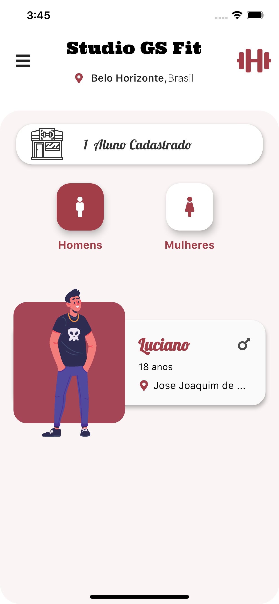 | 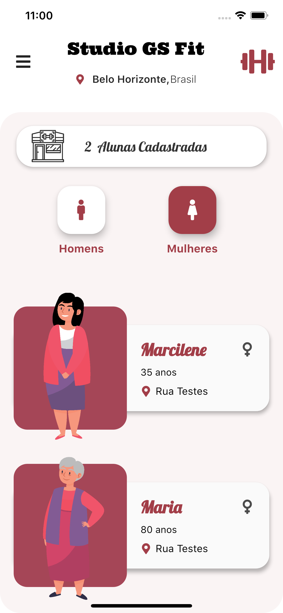 | 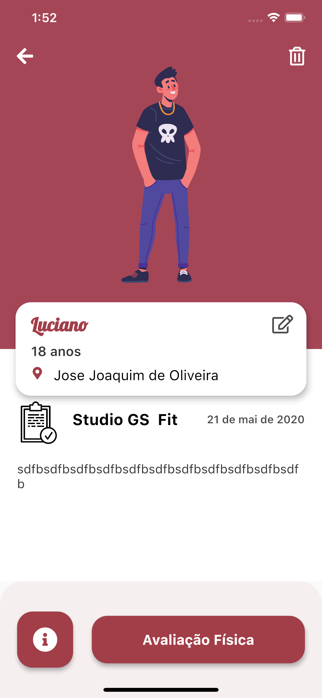 | 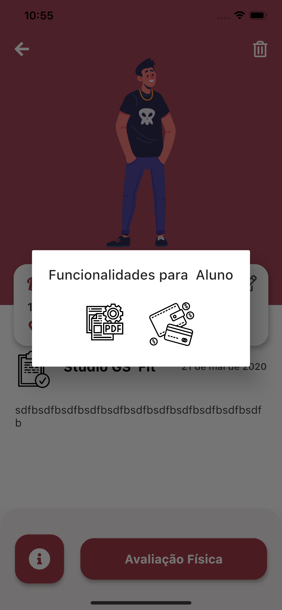

| Pdf | Share-Pdf | Payment | Body-Detail
|-----------------------------------------------------------------------------------------------------------------------------|-------------------------------------------------------------------------------------------------------------------------------|----------------------------------------------------------------------------------------------------------------------|--------------------------------------------------------------------------------------------------------------------------------
|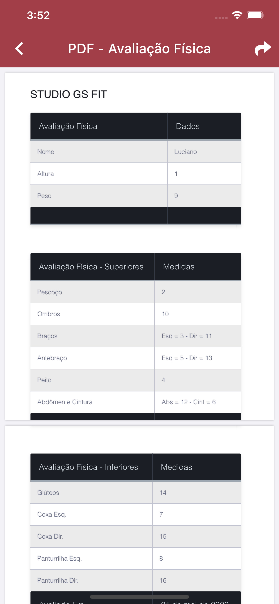 | 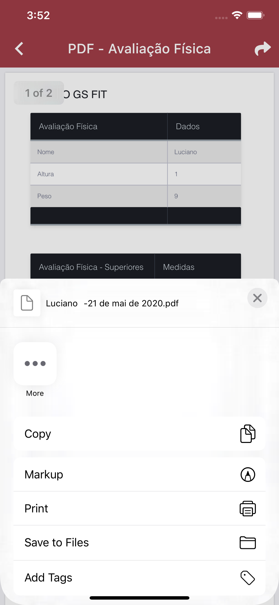 | 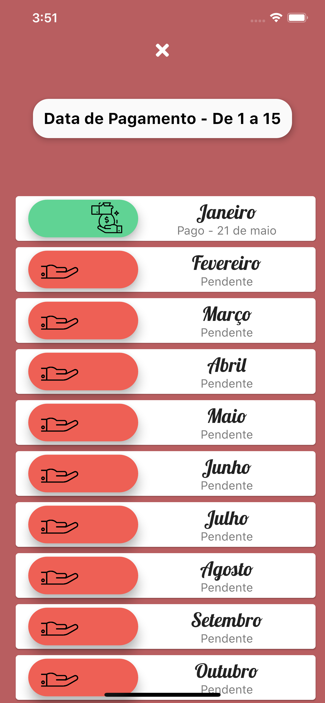 | 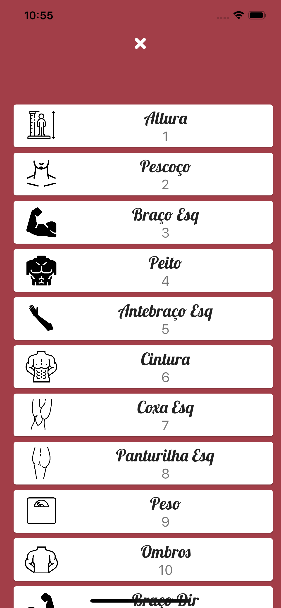

| Edit-Body | Delete | Register | Body-Register
|-----------------------------------------------------------------------------------------------------------------------------|-------------------------------------------------------------------------------------------------------------------------------|----------------------------------------------------------------------------------------------------------------------|--------------------------------------------------------------------------------------------------------------------------------
|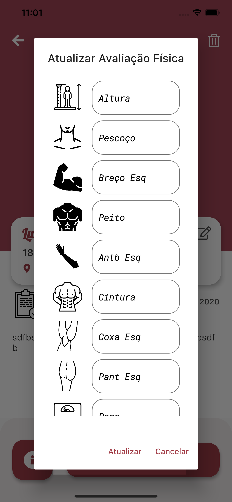 | 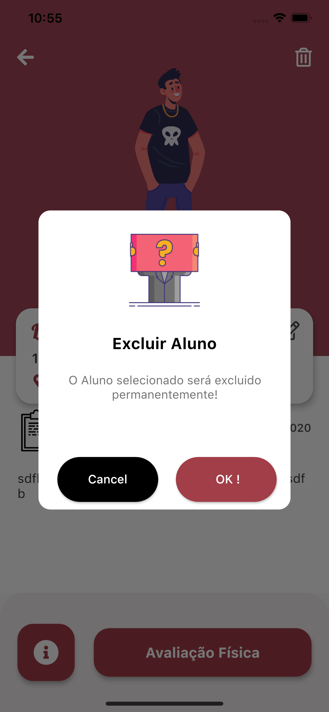 | 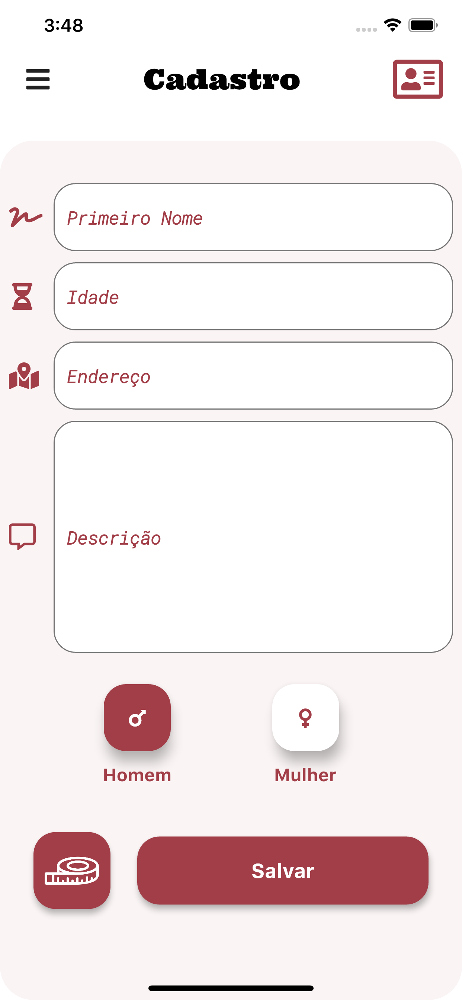 | 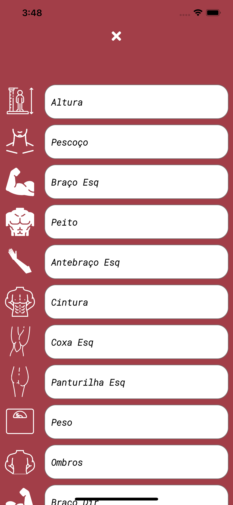

| Menu | BMI | Appointments | Icon-App
|-----------------------------------------------------------------------------------------------------------------------------|-------------------------------------------------------------------------------------------------------------------------------|----------------------------------------------------------------------------------------------------------------------|--------------------------------------------------------------------------------------------------------------------------------
|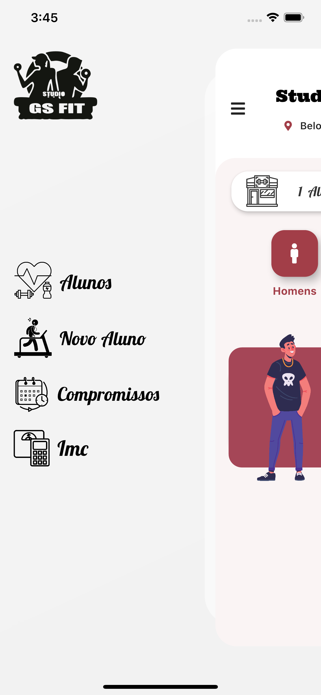 | 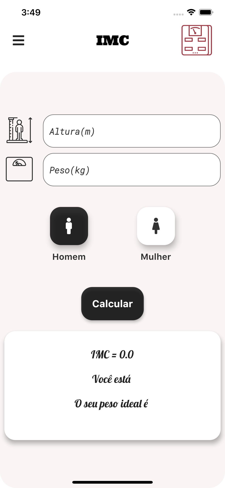 | 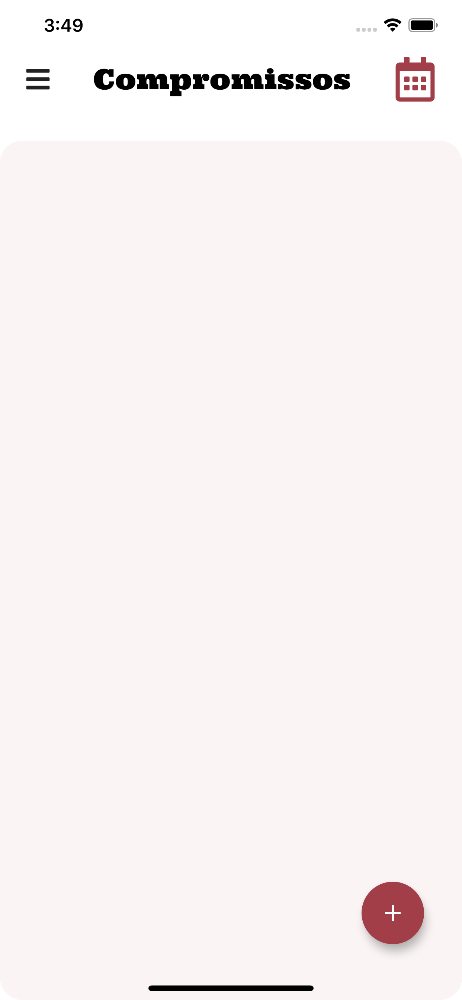 | 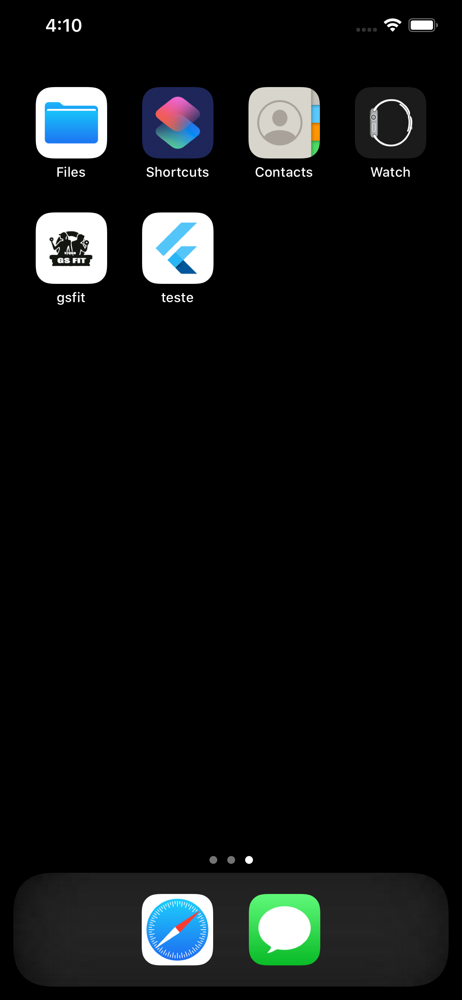

# Link to APK

https://appho.st/d/#/LQKEqoux
